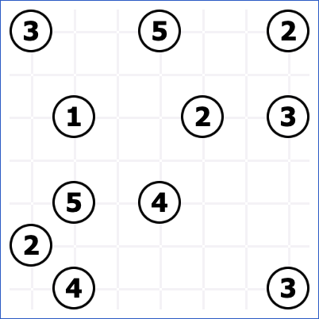
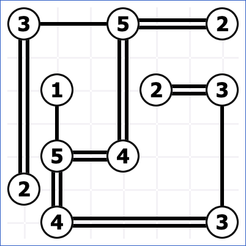

# Hashi Rules

Hashi (also called "Hashiwokakero" and "Bridges") puzzles consist of some numbers from 1-8 in circles, floating on a grid.

Each number represents an island. The goal of this puzzle is to draw bridges between islands in order to satisfy the following conditions:

* Each number represents the number of bridges connecting to that island.
* Bridges must be horizontal of vertical, and cannot cross or pass through other islands.
* The number of bridges between any two islands can be at most two.
* The bridges must form a single connected chain, so that you can get from any island to any other island.

Here is the solution to the above puzzle:

## Variations

* A simple variation is to allow N bridges between each island, where N != 2.

## Links to hashi puzzles

* https://www.puzzle-bridges.com/
