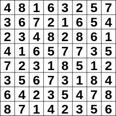
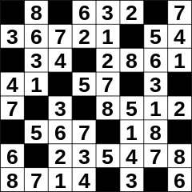

# Hitori Rules

Hitori (Japanese for "alone", "one person", or "leave me alone") puzzles consist of a grid (almost always square) with each cell containing a number.

(Images from [Wikipedia](https://en.wikipedia.org/wiki/Hitori))

The aim is to black out some cells to satisfy the following conditions:

* Each number in a row/column is unique
* No two black cells are orthogonally adjacent
* White cells are all orthogonally connected

It's common to circle a number if it's known to be white.

Here is the solution to the above puzzle:

## Links to Hitori puzzles

* https://www.puzzle-hitori.com/
