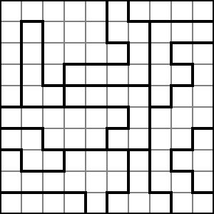
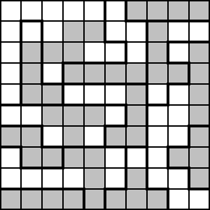

# LITS Rules

LITS (formerly "nuruomoni") puzzles consist of a grid (almost always square) divided into polyominos.

(Images from [Wikipedia](https://en.wikipedia.org/wiki/Lits))

The aim is to shade one of the L, I, T or S tetrominos into each region (in any orientation, including reflections), subject to the following conditions:

* Two adjacent tetrominos (touching orthogonally) cannot be of the same type.
* Shaded squares cannot form a 2x2 pool.
* Shaded squares must all be connected orthogonally.

The name of the puzzle comes from the 4 tetrominos that are used in the puzzle; note that the last tetromino (square) would violate the 2x2 pool rule.

Here is the solution to the above puzzle:

## Links to Lits puzzles

* https://www.puzzle-lits.com/
