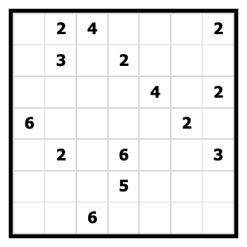
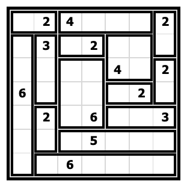

# Shikaku Rules

Shikaku (Japanese for "divide by squares" or "divide by box") puzzles consist of a grid (almost always square) with some cells containing a number.

The aim is to divide the grid into rectangular regions such that each rectangle contains a single number, and the number of cells in that rectangle equals that number. Every cell in the grid must be contained within a rectangle.
Here is the solution to the above puzzle:

## Links to Shikaku puzzles

* https://www.puzzle-shikaku.com/
