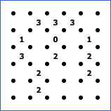
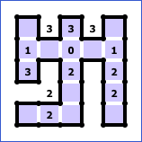

# Slitherlink Rules

Slitherlink puzzles (also called fences, loop the loop, or loop puzzles) consist of a dotted grid with numbers between the gridpoints, as in the following example.

The puzzle is to draw vertical/horizontal lines between dots to create a single loop across the grid that doesn't cross or branch. The numbers indicate how many loop segments are on the edge of that square.

Here is the solution to the above puzzle:

## Variations

* Sometimes there are sheep (or similar animals) in the grid; these are intended to be included inside the fenced region. It's also possible to have wolves (or similar threats) that need to be excluded from the fenced region.

## Links to slitherlink puzzles

* https://www.puzzle-loop.com/
