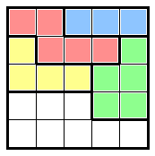
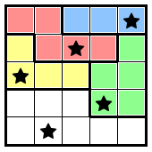

# Star Battle

Star Battle puzzles are played on an NxN square grid that has been divided into N regions. Each grid also has a star rating (usually 1-3 stars, with smaller grids having smaller ratings). The following is a 1-star grid:

The aim is to place a number of stars equal to the star rating in each row, column and region, subject to the following condition:
 
* Stars cannot be placed adjacent to each other (including diagonally).

Here is the solution to the above puzzle:

## Variations

* A "shapeless" variation is still played on a square grid, but has no regions defined. Instead, some cells are blacked out and cannot have a star placed on them. The goal is to place the star rating number of stars on each row and column, still subject to the adjacency constraint.

## Links to Star Battle puzzles

* https://www.puzzle-star-battle.com/
