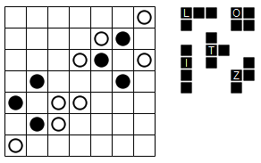
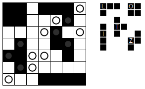

# Statue Park

Statue Park puzzles are played on a grid which can feature black and white circles. They always come with a list of pieces (usually tetrominos or pentominos), and an instruction as to reflections and/or rotations. Pieces are often labelled by letters for ease of identification.

The following puzzle allows both rotations and reflections.

(Images from [the original description of Statue Park puzzles](https://mellowmelon.wordpress.com/statue-park/).)

The aim is to place each of the pieces in the grid, subject to the following rules:
 
* Pieces cannot touch each other orthogonally.
* Pieces must cover black circles.
* Pieces may not cover white circles.
* The area not covered by pieces must be contiguous.

Here is the solution to the above puzzle:

## Links to Statue Park puzzles

* https://www.gmpuzzles.com/blog/statue-park-rules-and-info/
