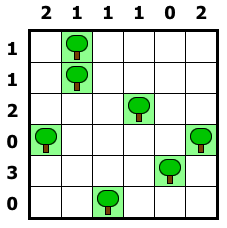
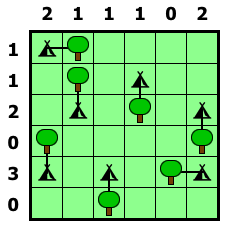

# Tent Rules

Tent puzzles (also called tent and tree puzzles) consist of a grid that contains some trees, with numeric clues for columns and rows.

The idea is to place tents and empty spaces (typically green for grass!) in the white cells, satisfying the following rules:

* Each tree must be tied to an adjacent tent (horizontally or vertically).
* Tents must be tied to a single tree only.
* Tents may not be placed next to each other (including diagonally).
* The number of tents in a row/column is given in the hints.

Here is the solution to the above problem:

## Variations

* It is not necessary for all rows/columns to be clued.

## Links to tent puzzles

* https://www.puzzle-tents.com/
