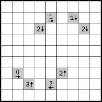
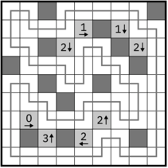

# Yajilin Rules

Yajilin (also called "Arrow Ring") puzzles consist of a grid with some cells containing a number and an arrow. There may also be some empty shaded cells.

(Images from [Wikipedia](https://en.wikipedia.org/wiki/Yajilin))

The aim of this puzzle is to construct a single continuous non-intersecting loop through the grid (turning at right angles). Any cell that the loop does not pass through is black. The numbers indicate the number of black cells in the specified direction. Black cells cannot be orthogonally connected to other black cells. Note that number cells and empty shaded cells are not considered black.

Here is the solution to the above puzzle:

## Variations

These variants are taken from a Mystery Hunt puzzle where I encountered them:

https://www.starrats.org/puzzle/the-neverending-story/

* Instead of just indicating black squares in a given direction, the numbers indicate black squares in that entire column or row (known as "Full Lane" yajilin).
* The numbers are all off-by-one (i.e., one too high or one too low) (known as "One Off" yajilin).
* Instead of counting black cells, the numbers indicate the number of cells walls that are crossed by the loop in that direction (known as "Closed Loop" yajilin).

## Links to yajilin puzzles

* https://www.gmpuzzles.com/blog/tag/yajilin-2+classic/
